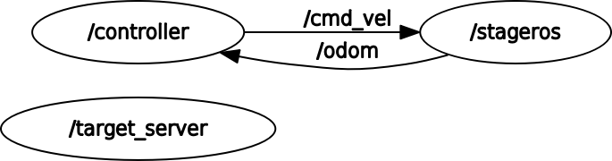

# Research Track I - first assignment

###### Maria Luisa Aiachini 4375373

The assignment1 package contains two nodes 
- The first node, controller, calls the service once the robot has reached the target and gives it minimum and maximum values as a request, to obtain a new one, always in x and y position, in between the min and the max given values. Then, by setting the velocities along x and y it makes the robot reach the new target.
- The second node, target_server, is used for, once received the min and max values from the service, computing the new target coordinates by computing random values
for x and y in between the given values.

The package contains the service target 
```
float32 min
float32 max

float32 x
float32 y
```
which contains minimum and maximum possible values of the target as a request and x and y position of the new target as a response.

The package finally contains also a message with three instances:
```
string name
float32 tarx
float32 tary
```
this contains the coordinates of the new target for the robot.

### Graph of the system


### Instructions

The simulator and the nodes can be launched by executing the command:
```
rosrun stage_ros stageros $(rospack find assignment1)/world/exercise.world
rosrun assignment1 target_server
rosrun assignment1 controller
```


